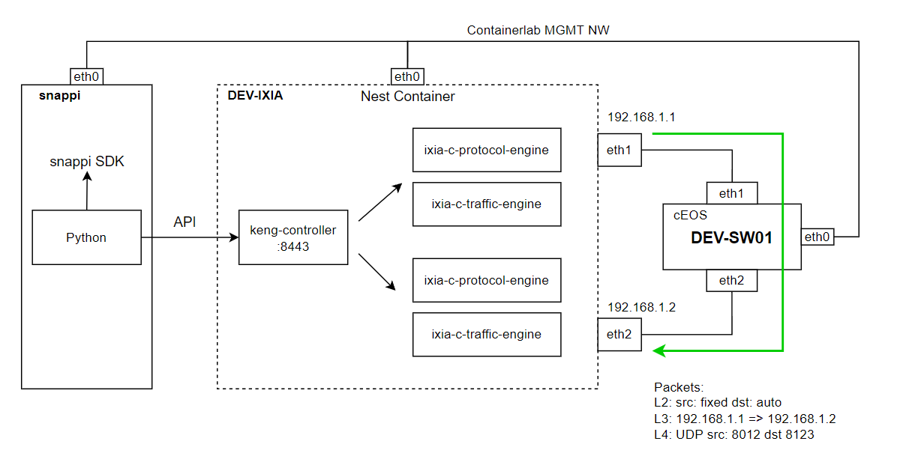

# ixia-c_containerlab
Notes on learning how to use ixia-c.

## Snappi Container Build
```
cd snappi
sudo docker build -t snappi:local .
```

## Image cEOS
Check this page: https://containerlab.dev/manual/kinds/ceos/

## Usage
- Containerlab Deploy
```
sudo containerlab deploy --topo sample01_ixia-c.clab.yml
```
- Traffic Start
```
cd scripts
```
```
docker container exec -it snappi python /scripts/start_traffic.py {config_file} {seconds}

ex)
docker container exec -it snappi python /scripts/start_traffic.py sample01.yml 5
```
config_file: ixia-c config  
seconds: The time to flow traffic.

- Containerlab Destroy
```
cd {ixia-c_containerlab}
sudo containerlab destroy --topo sample01_ixia-c.clab.yml
```

## ixia-c Config
ixia-c Config is in `scripts/ixiaconf`  
The config is written in YAML that complies with OTG.  
Check this page: https://github.com/open-traffic-generator

### Sample01
It performs UDP communication in a simple configuration contained within a single segment.  



## Packet Capture
DEV-IXIA captures files.  
 It will be saved `in scripts/pcapfile`